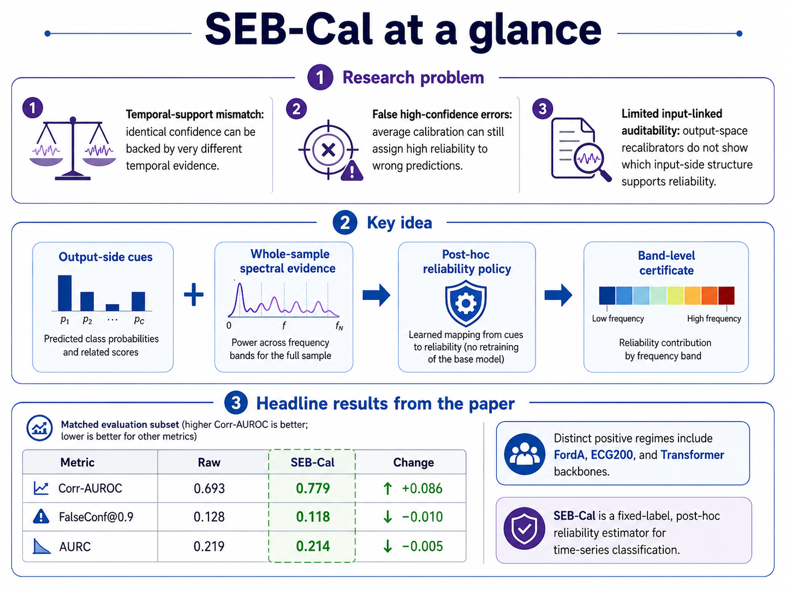
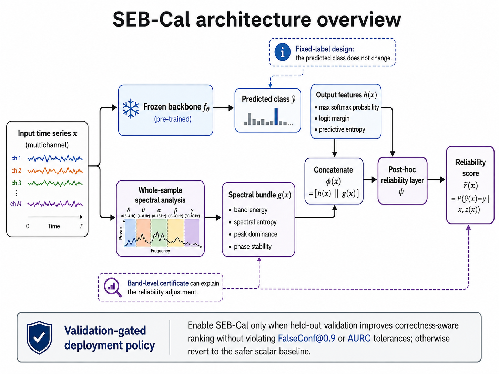

> **Beyond Output-Space Calibration: Spectral Evidence Bundling for Selective Reliability Estimation in Time-Series Classification**

SEB-Cal is a **fixed-label, post-hoc reliability policy** for time-series classifiers. It leaves the trained backbone and predicted class unchanged, then estimates whether that prediction should be trusted by combining output-side calibration cues with deterministic whole-sample spectral evidence.



---

## 1. Research problem

Standard post-hoc calibration usually remaps output scores. In time-series classification, this is incomplete because deployment decisions such as trust, abstention, triage, or review depend on whether the current temporal signal actually supports the confident prediction.

SEB-Cal targets three time-series-specific gaps:

1. **Temporal-support mismatch:** identical confidence values can be supported by different temporal evidence.
2. **False high-confidence errors:** average calibration can still assign high reliability to wrong predictions.
3. **Limited input-linked auditability:** output-space recalibrators do not expose which input-side signal structure supports the reliability estimate.

---

## 2. Architecture design



SEB-Cal has two branches:

- **Output branch `h(x)`**: maximum softmax probability, logit margin, and predictive entropy from the frozen backbone logits.
- **Spectral branch `g(x)`**: whole-sample FFT descriptors summarizing band energy concentration, spectral entropy, peak dominance, and phase stability.

The two branches are concatenated and passed to a shallow reliability layer:

```text
φ(x) = [h(x) || g(x)]
r̃(x) = ψ(φ(x)) ≈ P(ŷ(x)=y | x, z(x))
```

The method is **fixed-label**: `ŷ(x)` never changes. Only the reliability score `r̃(x)` changes.

The deployed object is a **validation-gated policy**, not an unconstrained spectral score. SEB-Cal is selected only when held-out validation improves correctness-aware ranking without violating FalseConf@0.9 or AURC tolerances; otherwise the policy reverts to Raw confidence or a safer scalar recalibrator.

---

## 3. Main results included in this artifact

The paper evaluates SEB-Cal across eight UCR/UEA datasets, eight time-series backbone families, and standard output-space recalibrators. The main benchmark uses a matched evaluation subset of **191 dataset--model--seed configurations**.

### 3.1 Aggregate fixed-label reliability


| Method | ECE ↓ | Brier ↓ | NLL ↓ | Corr-AUROC ↑ | FalseConf@0.9 ↓ | AURC ↓ | Faith. ↑ |
|---|---:|---:|---:|---:|---:|---:|---:|
| Raw | 0.097 | 0.377 | 0.716 | 0.693 | 0.128 | 0.219 | -- |
| Temperature | 0.080 | 0.371 | 0.717 | 0.689 | 0.162 | 0.219 | -- |
| Platt | 0.078 | 0.384 | 0.745 | 0.671 | 0.228 | 0.218 | -- |
| Dirichlet | 0.153 | 0.422 | 0.983 | 0.673 | 0.153 | 0.226 | -- |
| Vector | 0.155 | 0.420 | 0.975 | 0.672 | 0.149 | 0.227 | -- |
| Isotonic | 0.144 | 0.421 | 1.977 | 0.644 | 0.292 | 0.227 | -- |
| Unconstrained SEB-Cal | 0.077 | 0.372 | 0.710 | 0.779 | 0.118 | 0.214 | 0.059 |
| Policy-selected SEB-Cal | **0.075** | **0.370** | **0.708** | **0.786** | **0.094** | **0.209** | -- |

**Interpretation.** Unconstrained SEB-Cal tests whether spectral evidence adds reliability information beyond output-score remapping. Policy-selected SEB-Cal is the deployed policy and gives the safest aggregate operating point.


### 3.2 Frequency-bundle ablation

| Variant | Corr-AUROC ↑ |
|---|---:|
| Remove all `g(x)`: output-side only `h(x)` | 0.703 |
| `h(x)` + energy only | 0.778 |
| `h(x)` + entropy only | 0.733 |
| `h(x)` + peak only | 0.756 |
| `h(x)` + phase only | 0.734 |
| Full SEB-Cal bundle `h(x)+g(x)` | 0.786 |
| Full bundle without energy | 0.752 |
| Full bundle without entropy | 0.786 |
| Full bundle without peak | 0.784 |
| Full bundle without phase | 0.787 |

This ablation is a **mechanism test for ranking signal**, not a deployment-safety table. FalseConf@0.9 and AURC safety are evaluated by the validation-gated policy.


## 4. Repository structure

```text
.
├── README.md
├── main.tex
├── references.bib
├── requirements.txt
├── run_benchmark.sh
├── scripts/
│   └── make_readme_figures.py
├── src/
│   ├── __init__.py
│   ├── datasets.py
│   ├── models.py
│   ├── training.py
│   ├── calibration.py
│   ├── evaluation.py
│   ├── run_one.py
│   └── run_all.py
├── results/
│   ├── paper_values/
│   │   ├── table1_main_results.csv
│   │   ├── table2_dataset_decomposition.csv
│   │   └── table4_frequency_bundle_ablation.csv
│   ├── master_metrics.csv                  # generated by benchmark run
│   └── runs/                               # per-run JSON outputs
├── tables/
│   ├── main_results_table.tex              # generated by benchmark run
│   └── ablation_table.tex                  # generated by benchmark run
├── figures/
│   ├── architecture_overview.png
│   ├── main_results_summary.png
│   ├── dataset_regime_structure.png
│   ├── falseconf_diagnostic_by_dataset.png
│   ├── frequency_bundle_ablation.png
│   ├── validation_gate_policy.png
│   └── readme_results_panel.png
└── logs/
    └── progress.log                        # generated by benchmark run
```


---

## 5. Installation

```bash
python -m venv .venv
source .venv/bin/activate        # Linux/macOS
# .venv\Scripts\activate         # Windows PowerShell
pip install --upgrade pip
pip install -r requirements.txt
```

The code uses public UCR/UEA time-series datasets through `aeon` and downloads them automatically when first requested.

---


## 6. Quick smoke test

Run one dataset, one backbone, and all calibration methods:

```bash
python -m src.run_one \
  --dataset ECG200 \
  --model mlp \
  --seed 7 \
  --gpu 0 \
  --calibrators none temperature platt isotonic vector dirichlet sebcal \
  --results_dir results \
  --tables_dir tables \
  --figures_dir figures \
  --logs_dir logs
```

Expected outputs:

```text
results/runs/ECG200__mlp__seed7__*.json
results/master_metrics.csv
tables/main_results_table.tex
tables/ablation_table.tex
figures/corr_auroc_by_calibrator.png
figures/ece_vs_falseconf.png
logs/progress.log
```

---

## 8. Full benchmark run

```bash
python -m src.run_all \
  --gpus 0 1 \
  --datasets ECG200 FordA Wafer ElectricDevices UWaveGestureLibrary BasicMotions SelfRegulationSCP1 AtrialFibrillation \
  --models mlp lstm gru tcn fcn resnet1d inceptionlite transformer \
  --calibrators none temperature platt isotonic vector dirichlet sebcal \
  --seeds 7 13 21 \
  --results_dir results \
  --tables_dir tables \
  --figures_dir figures \
  --logs_dir logs
```

For the exact paper-scale benchmark, use the fixed split/seed configuration supplied with the artifact. The full benchmark is compute-heavy because it trains eight backbone families across multiple datasets and seeds.

---

## 9. What is reproduced by the current code?

This artifact provides:

- SEB-Cal spectral evidence extraction;
- output-side calibration features;
- shallow fixed-label reliability layer;
- standard scalar recalibrators;
- UCR/UEA dataset loading;
- multiple backbone families;
- fixed-label reliability metrics;
- paper-value CSVs for transparent inspection.

---

## 10. Citation

If this artifact is used, cite the anonymous NeurIPS 2026 submission:

```bibtex
@inproceedings{anonymous2026sebcal,
  title     = {Beyond Output-Space Calibration: Spectral Evidence Bundling for Selective Reliability Estimation in Time-Series Classification},
  author    = {Anonymous Author(s)},
  booktitle = {Submitted to NeurIPS},
  year      = {2026}
}
```
